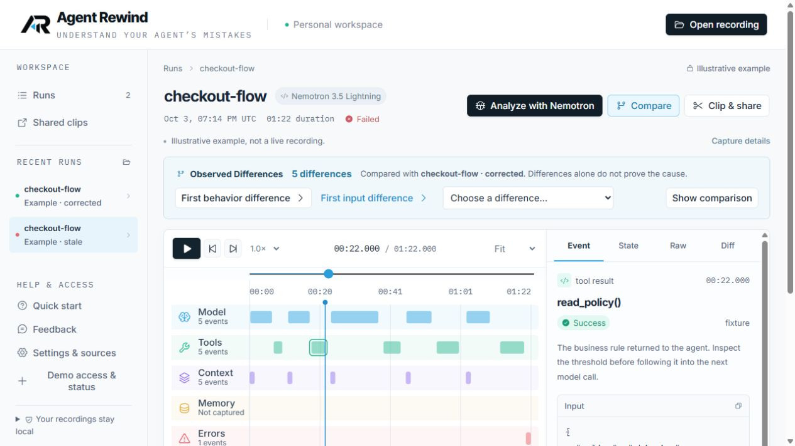

# Analysis access and discoverability — October 7, 2026

The selected run now has a primary **Analyze with Nemotron** action above the timeline. It opens the existing review dialog; it does not send evidence. After the privacy review, **Continue to analysis** scrolls and focuses the analysis controls. Free report copy/download remains available alongside it.

The invitation form explains that owner, tester and judge codes protect the host's paid allowance. These are separate from the server's Nebius API key. Existing authentication, explicit send consent and spending limits are unchanged. The existing owner credential was verified without publishing or replacing it. The browser session lasts up to seven days.

Verification: production build, 55 frontend unit tests and 28 browser tests passed. The navigation regression checks disabled review controls, keyboard focus, zero paid requests and focus restoration. An independent review found no implementation blockers; its documentation-label finding was corrected. The deployed toolbar and review-to-analysis navigation were checked in the live browser. No paid inference or sandbox execution was performed.

- Implementation commit: `3205fea`
- Cloudflare version: `17a52059-be85-40dd-bb2f-15d44327b5d1`
- [GitHub checks](https://github.com/cnoles1980/agent-rewind/actions/runs/37716054919)
- [Diagnostic-quality limitations remain open](report-quality-2026-10-07.md).

