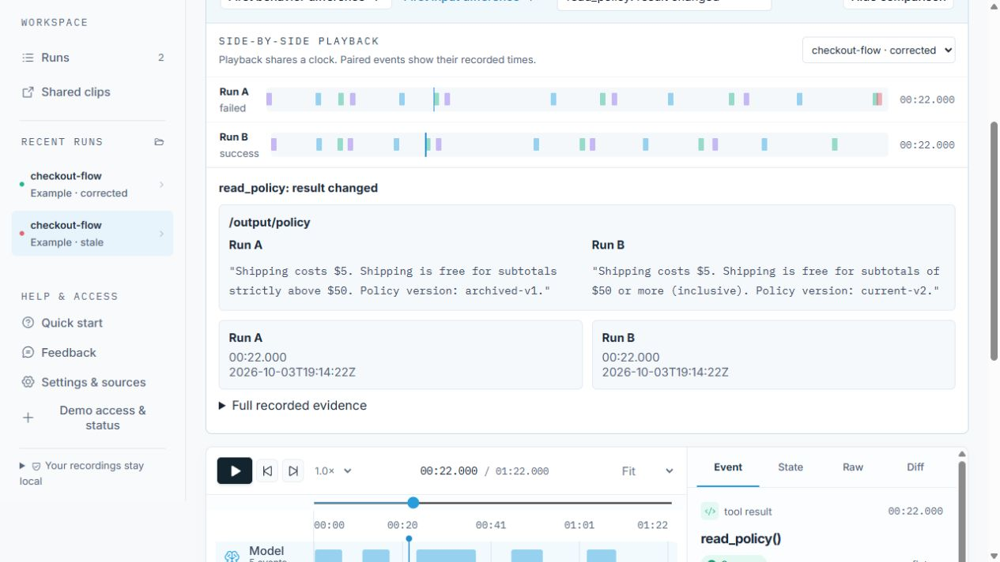
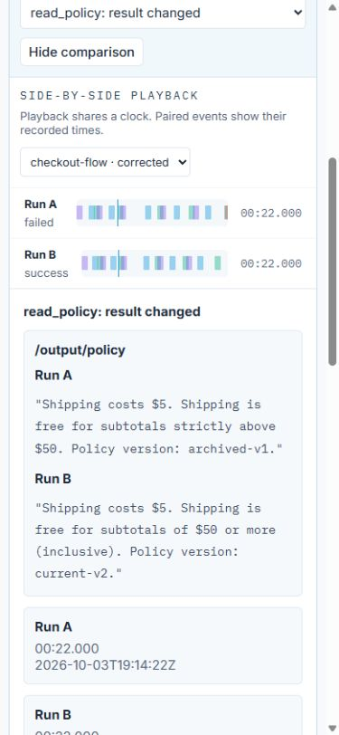

# Comparison evidence and CI follow-up — October 4, 2026

The layout commit `ddf46e9` was committed and pushed successfully. Its [GitHub check](https://github.com/cnoles1980/agent-rewind/actions/runs/37254109693) failed when Miniflare's HTTP connection reset during a deliberately oversized clip upload. The following copy commit `153ec9a` [passed all checks](https://github.com/cnoles1980/agent-rewind/actions/runs/37254573609) without a backend change.

The oversized-body test now constructs the request inside the Worker test runtime and sends it to the real application route through a service binding. This avoids racing an early rejection against Node's HTTP upload. It checks both fixed-length and streamed oversized bodies, asserting HTTP 413 and the error message. Other integration requests still use the HTTP interface. No production size limit, authorization check, or spending control was changed.

## Easier comparison

Selected differences show changed field values first. Behavior differences focus on results and status; input differences focus on arguments and captured context. Actual event times remain visible. Full recorded evidence expands on demand, retaining the original sanitized values and timestamps. The summary follows the existing comparison normalization rules; it does not infer a cause.

Previews are bounded to 30 changed fields, 2,000 visited nodes, six levels of expanded nesting, and 1,200 characters per value. Limited previews are labeled and the full evidence remains available. Missing captures, nulls, empty arrays, and unmatched events remain distinct.

## Verification

- 55 frontend unit tests passed, including new checks for changed values, volatile metadata, missing captures, unusual field names and preview bounds.
- All 28 browser tests passed; the two navigation tests passed again after the final display adjustment.
- Worker type check, build and all 10 hosted integration tests passed.
- Production frontend build passed. Live desktop and 390-pixel mobile comparison verified; no horizontal page overflow at the checked mobile size.
- Configured credential scan found no known keys, invitation codes or hashes in public files, the browser build, or Git history.
- Cloudflare deployment: `7e6fb502-809f-4252-9115-3174524f29d8`.

No paid model calls, sandbox runs, new permissions or budget changes. Sandbox access/integration, difficult real-case report quality, unassisted human testing and final submission artifacts remain open gates. See the [product audit](product-ux-audit-2026-10-04.md).
