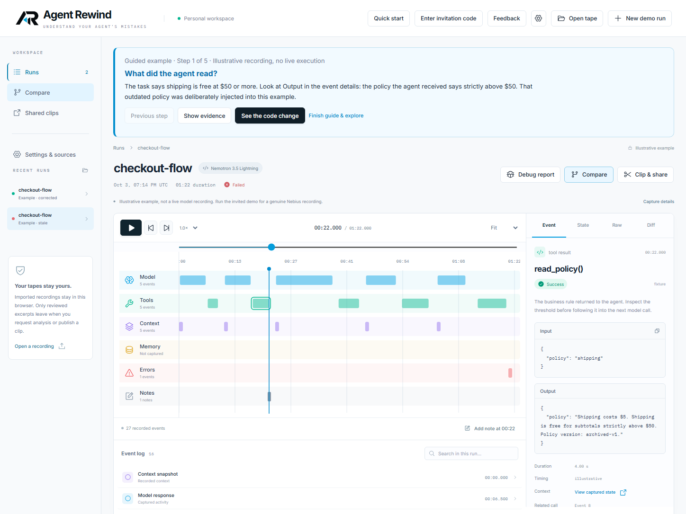

# Your first investigation in Agent Rewind

Allow about five minutes. Start with the examples; no invitation, API key, or personal log is needed. Open the app and choose **Start tutorial**. You can reopen the six-step guide under **Settings & sources → First-use tutorial**.

## 1. Find the bad policy

In **Recent runs**, choose **checkout-flow — Example · stale**. Select **read_policy()** in the Tools lane. The right inspector shows the returned archived rule: free shipping strictly above $50.

The intended requirement is free shipping **at $50 or more**. The stale condition is deliberately injected. The bundled examples are illustrative recordings, not live execution evidence.

## 2. Follow its consequence

Select subsequent tool events to inspect the recorded code change and test result. Find the acceptance check for a subtotal of **50**: the stale example charges shipping and fails that assertion.

- **Event:** captured inputs, results, errors, and related activity.
- **State:** captured context available at that moment; absent context stays unknown.
- **Raw:** sanitized captured data.
- **Diff:** recorded before/after code when available.

Use search, previous/next event, or the playhead to navigate. Space plays/pauses; arrow keys move between timed events outside text fields/dialogs. Zoom up to **6,400%**, or use **Fit**. Playback only inspects recordings; it never executes code or calls a model.

## 3. Compare the corrected evidence

The **Observed Differences** panel is above the player. Choose **Jump to first behavior difference** and inspect the two policy responses. The corrected example includes the $50 boundary. Expand A/B playback to navigate the paired runs.

Differences identify changed evidence and behavior. They do not automatically prove the cause of a failure.

## 4. Open one of your logs

Choose **Settings & sources → Codex → Open Codex log**. Select one session `.jsonl` from `~/.codex/sessions/YYYY/MM/DD/`; on Windows, start in `%USERPROFILE%\.codex\sessions`. A custom `CODEX_HOME` changes that location.

The file is read, converted, and stored in this browser without uploading it. Review **Capture details** for unknown records, missing context, and timing limitations. Limits are **100 MB / 10,000 events**; oversized or unsupported files report an error. Keep important exports before clearing browser storage.

Claude Code, n8n, Factory, and custom instructions are in the same settings panel. Factory currently supports a result summary only. See [source-specific instructions](sources.md). You do not connect an account or give Rewind your agent's API key to import a recording.

## 5. Create a handoff for your coding agent

For hosted access, open **Settings & sources → Manage invitation access**, enter the private code supplied by the host, and choose **Unlock invited features**. This enables analysis and sharing; it does not enable sandbox runs while the execution gate is closed.

Select the consequential event and choose **Debug report**. Describe what happened and what you expected. Review the exact evidence preview, add extra redaction phrases if needed, and check the review box. Copy or download the Markdown, then paste it into your existing agent chat yourself.

This evidence-only report works without an API key. For **optional Nemotron analysis**, invited users enter their invitation code, review the excerpt, and explicitly consent to sending it. Choose **Analyze selected evidence**. Read the **Recorded excerpts** and follow their citations, then review the **Investigation questions** and suggested checks before copying the handoff. Rewind checks that quoted text exists in the selected evidence, but the questions may still be wrong. The handoff asks your agent to inspect the project and confirm the cause before changing anything.

If the report only contains event metadata, choose an event with captured input/output or an error. Rewind will explain that more evidence is needed without making a paid call. Keep JSON blocks intact when editing the preview. Each admitted hosted analysis sets aside 25 cents of the host's internal allowance; this is a spending safeguard, not the supplier's actual charge.

Only the reviewed excerpt is sent to Nebius. Analysis uses the host's server-side key and budget. Judges receive a private invitation and need no API key. Self-hosters configure their own key using [analysis setup](analysis.md). Rewind never posts into your agent chat or repairs code automatically.

## 6. Export or share a narrow clip

Choose **Clip & share**, set the range, and read the full preview. Supporting context is excluded by default because it can contain earlier private messages. Add redactions, then check the review box.

**Export clip** saves a local file without uploading it. **Create share link** requires invited access and publishes that reviewed clip. Anyone with its unlisted link can read it. Revoke it under **Shared clips** in the same browser. Clearing browser storage loses its saved management credential.

## Try a fresh coding run only when enabled

**New demo run** is a separate action from replay. Enter your invitation, select the stale or corrected policy, and choose **Launch fresh run**. The server calls Nemotron and executes only the allowlisted checkout fixture in a remote sandbox. Outcomes follow actual acceptance tests; success is never forced.

If the launch button is disabled, read the listed configuration blockers. Analysis can work while sandbox execution remains unavailable. Do not supply judges with your Nebius key to bypass this gate.

## If something does not work

| Symptom | Next step |
|---|---|
| No account connection button | Import a selected recording file through Settings & sources. |
| File rejected | Check its format, 100 MB size, 10,000-event limit, and the import report. A workflow definition is not an n8n execution log. |
| Empty State or Memory lane | That data was not captured. Rewind does not reconstruct hidden model context. |
| Copy/export disabled | Review the current preview again. Changed evidence clears previous approval. |
| Analysis unavailable | Host: follow analysis setup and restart the API. Judge: contact the host with the displayed blocker, never request its key. |
| Local startup issue | Follow the commands in the [README](../README.md#run-locally), then check the ignored `.local` logs. |
