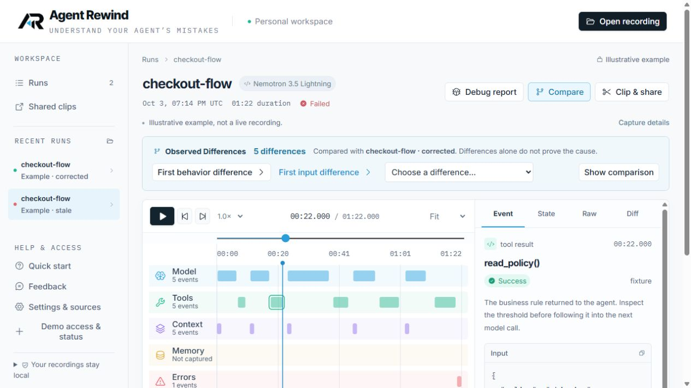
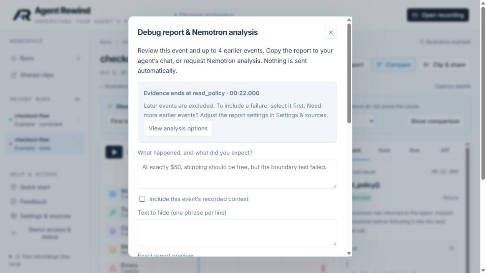

# Clearer interface copy — October 4, 2026

Shortened repeated explanations in the welcome, guided example, comparison, report, analysis, settings, feedback and clip review. No new screens or interactions were added.

| Before | After |
|---|---|
| Show A/B evidence & choose run | Show comparison |
| Jump to first behavior difference | First behavior difference |
| Preceding events in debugging reports | Earlier events in reports |
| Additional text to redact (one phrase per line) | Text to hide (one phrase per line) |
| Include the selected event’s linked context snapshot | Include this event’s recorded context |
| Go to Nemotron analysis options | View analysis options |

The shorter comparison copy fits in fewer rows at the checked desktop width, leaving more room for the timeline.

Privacy review, paid-call consent, Nebius data handling, server retention, public-link visibility, omitted future evidence and unverified model suggestions remain explicit. Captured personal logs and application-written instructions in copied handoffs were not rewritten. Removed a duplicate on-screen guardrail paragraph; the full guardrail remains in the exact copy/export preview and handoff. Only the illustrative examples' provenance warning was shortened.

Production build and all 28 browser checks passed. Report and comparison wording were inspected on the live deployment. Cloudflare version: `8139a30d-5704-4ed8-be69-4d5f022e37a3`. No paid model calls, permission changes, budget changes or provider changes. Human comprehension remains to be tested; shorter copy alone does not establish usability success.
