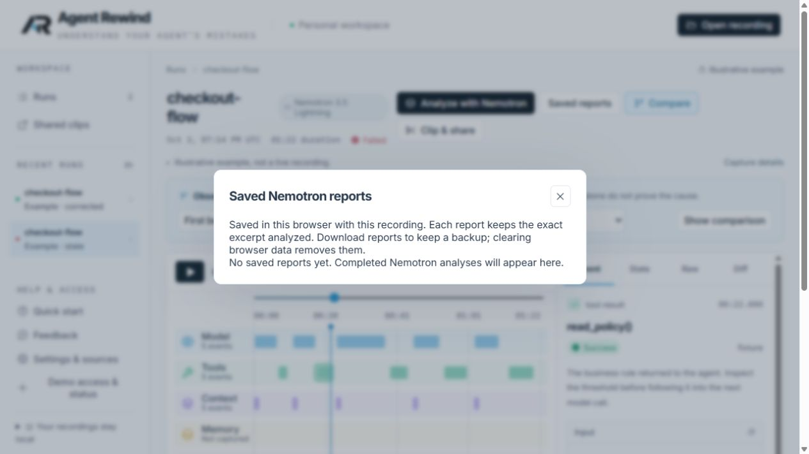

# Saved report archive — October 7, 2026

Completed Nemotron reports now save automatically beside their recording in this browser. **Saved reports**, beside **Analyze with Nemotron**, opens dated entries for the selected run. Each entry keeps the original reviewed excerpt, model/provider, response and anchor. Reopening does not contact the analysis API. Existing closed reports cannot be recovered from server accounting metadata.

The archive is IndexedDB version 2. Migration preserves tapes and share-management records. Saving a missing tape and its report is atomic; an existing tape is not overwritten, preserving newer annotations. Reports remain historical even if the recording later changes. Missing-event citations explain the limitation inside the dialog. Deleting a report requires confirmation; removing its tape deletes associated reports.

Storage failure leaves the completed result visible and downloadable without a false saved confirmation. Completed reports are local data, not encrypted cloud backups or cross-device sync. They are deliberately excluded from tape exports and shared clips. Download important analysis files separately. Closing during an unfinished request still discards that response; this feature archives completed responses only.

## Verification

- Production TypeScript/Vite build and 55 frontend unit checks passed.
- The first full browser run passed 34 of 35 checks; the remaining test hardcoded database version 1. Updated that test to read the current database without requesting an older version.
- All 10 targeted analysis/large-import browser checks then passed, including migration, two reports, close/reload, frozen excerpts, per-run separation, deletion cascade, obsolete citations, inert HTML and simulated quota failure. Analysis responses in these browser tests are synthetic mocks; no model-quality claim follows from them.
- Independent review requested the in-dialog missing-citation message; the fix and regression test were reviewed with no remaining scoped blockers. Shared rendering avoids divergent fresh/archive handoffs. No new dependencies, server authorization changes, inference paths or spending changes.
- Feature commit: `fd01e85`; assessment commit: `9b75e84`.
- [GitHub verification passed](https://github.com/cnoles1980/agent-rewind/actions/runs/37724426612) on `9b75e84`, including Python, frontend, Cloudflare integration, generated-contract checks and the full browser suite.
- Cloudflare deployment: `ba5a6b77-c094-49f9-a1e5-e1052c540dc8`. The deployed archive button and empty archive were inspected in the browser. Public status retained analysis availability and the existing sandbox blockers.

No paid inference or sandbox call was made for this change. Final submission priorities are in the [readiness assessment](submission.md).
