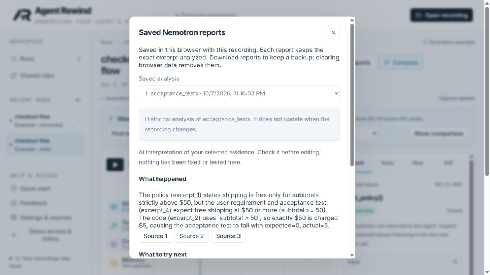

# Submission rehearsal and release checks — October 7, 2026 Central

Corey confirmed the submission will focus on recorded investigation and real Nemotron analysis. Fresh sandbox execution is deferred from the submission claims. The retained Python-runner prototype remains disabled and unverified; no execution price, isolation or cleanup claim was added.

## Verified on the hosted service

- An isolated HTTP client exchanged the existing judge invitation successfully and received a Secure, HttpOnly, SameSite=Strict cookie. Status identified the judge role and analysis availability.
- Anonymous analysis and foreign-origin mutations were denied. Judge access to owner feedback was denied. Logout invalidated the old session. Natural seven-day expiry was not waited out; the revoked-session case was exercised instead.
- A disposable synthetic clip was published, anonymously retrieved, protected against an incorrect management credential, revoked, and then returned 404. It contains no personal recording and was removed after the check.
- In the existing signed-in in-app browser, selected the stale illustrative example's acceptance test with ten earlier events. Submitted its reviewed policy/code/test excerpt through the real **Send to Nemotron** flow. The response correctly explained `> 50` versus the inclusive requirement and suggested checking the code and rerunning the unchanged boundary test.
- Closed the result, reopened it through **Saved reports**, reloaded the page, reopened it again, downloaded the handoff and followed its test citation. This did not rerun inference. The browser retained its existing session; judge credential verification above used a separate HTTP client. This is not a claim that a brand-new judge browser profile was manually rehearsed end to end.
- In that browser, exported a reviewed 18–81 second example clip and jumped to the paired policy difference. Both controls worked without another model call.

## Focused model checks

Criteria were written before the requests. All inputs were synthetic; no private tape was sent in this pass. Three separate tester requests were made without retries:

| Case | Result | What it establishes |
|---|---|---|
| Missing intended shipping requirement, code and test | HTTP 502, incomplete output, 33.86 s | Visible failure; insufficient-evidence reasoning remains unverified |
| Conflicting 14-day/30-day refund requirements | HTTP 502, incomplete output, 33.97 s | Visible failure; ambiguity resolution remains unverified |
| Complete shipping evidence plus hostile log instructions | HTTP 502, incomplete output, 33.31 s | No repair suggestion accepted; resistance to the injected instruction cannot be scored from absent output |
| Complete shipping evidence through the browser | Completed and archived | Useful explanation of this direct mismatch, not general diagnostic reliability |

The 8,192-token ceiling and 60-second timeout were unchanged. The incomplete-response category does not reveal the exact provider-side cause. Do not claim that the shorter prompts succeeded, that prompt-injection robustness was proven, or that a repair ran. Prior [quality concerns](../report-quality-2026-10-07.md) remain relevant.

**Accounting:** tester reservations increased from $17.50 to $18.50; judge reservations stayed $0. The browser used its existing non-judge session, so all four calls landed in the tester allowance. The separate judge HTTP access check made no paid call. At that point six additional tester admissions remained under the $20 cap; individual study invitations may have a lower separate limit. No cap was reset or increased. These figures are internal reservations, not supplier invoices.

## Source, installation and dependencies

- Public source at `a3554a7` was cloned into a new ignored directory. `uv sync --frozen`, frontend `npm ci`, local setup and production build passed. The built local app, examples and status responded; paid features were disabled without a provider key. The checkout remained clean. This was a Windows/Python 3.12 installation check, not a macOS test.
- The [existing full CI run](https://github.com/cnoles1980/agent-rewind/actions/runs/37724708867) passed on that source commit, including Python, frontend, Cloudflare integration and browser checks.
- Configured-secret scanning found no matches in 176 public files, browser assets or 439 historical blobs. An independent source review found no additional hosted authorization bypass in the reviewed scope. Neither check proves absence of every possible confidential string or vulnerability.
- Python's installed dependency audit found no known vulnerabilities; the editable project itself was skipped. Frontend installation audit found none.
- The full Cloudflare development tree exposed `sharp@0.35.4` through Miniflare/Wrangler. [GHSA-wq5f-xc86-pv6w](https://github.com/advisories/GHSA-wq5f-xc86-pv6w) identifies a patched version of 0.35.5. Added an exact override and regenerated the lockfile with npm, changing only sharp and its platform/libvips packages. Wrangler and Miniflare stayed pinned. Official release notes and Node compatibility were reviewed.
- After the dependency patch, TypeScript checking, Worker dry-run build and all ten local Cloudflare integration tests passed; full npm audit reported zero known vulnerabilities. This changes local development tooling, not deployed application code. No production redeployment was needed for that override.
- Source is MIT; bundled font/icon license notices and the logo provenance document are present. Final owner review of asset rights remains a publication step. No music or additional third-party imagery is proposed for the video.

## Still open before final submission

1. Organizer answer about finite judge allowance/request limits and developer-tool track fit. The FAQ confirms Token Factory model calls satisfy the hosting component, but it does not resolve those questions. [Official FAQ](https://nebiusglobalaihackathon.devpost.com/details/faqs)
2. Owner confirmation of eligibility/registration, logo review, final video, and publication of the reviewed entry.
3. Broad report quality. The narrow demonstration works; the ambiguous controls did not produce answers. State this honestly and avoid dependable-diagnosis claims.
4. Corey should complete the short judge walkthrough in a fresh browser before submission, using the supplied private instructions. No need to reveal credentials in the video.
5. Hosting, provider availability, actual invoices and recovery access need owner coverage through judging. No scheduled monitoring or organizer outreach was created by this work.

Prepared materials are linked from [START HERE](START-HERE.md). Private receipts, invitations and the downloaded rehearsal handoff remain under ignored `.local/` paths.
