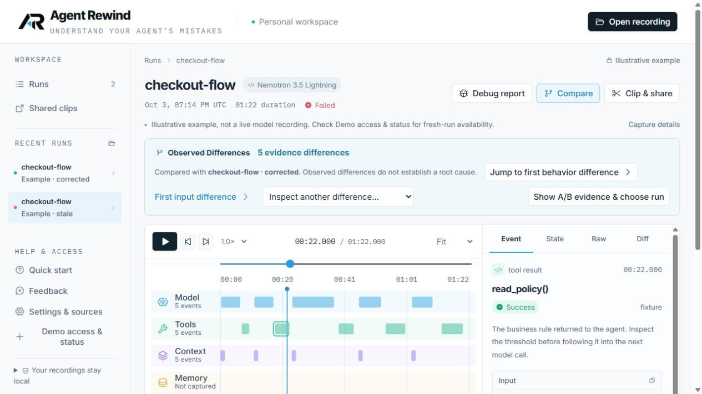
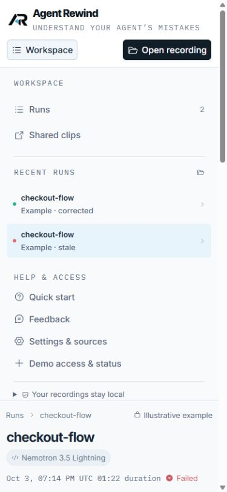

# Workspace layout follow-up — October 4, 2026

The top bar now has one primary action: **Open recording**. Run-specific actions remain next to the current run: **Debug report**, **Compare**, and **Clip & share**.

Quick start, invitation entry (when signed out), Feedback, Settings & sources, and demo access are grouped under **Help & access** in the lower-left sidebar. The duplicate sidebar Compare button and duplicate import action were removed. The privacy explanation remains available in an expandable note. Recent recordings scroll independently when space is limited; utility controls stay grouped below them.

On narrow screens, **Workspace** reveals recent runs, Shared clips, and the same utility controls. Selecting a recording closes that menu; Escape returns keyboard focus to its toggle. Run-specific actions share a horizontal row on phones. The layout preserves readable text sizes rather than shrinking labels to fit.

Verification: production build and all 28 browser checks passed, including mobile run selection, menu dismissal/focus, settings access, tutorial reopening, report consent and import privacy. Desktop and 390 × 844 navigation were also inspected on the live deployment; the viewport was restored afterward. Cloudflare version: `318e2132-ee43-4f19-9196-7a6140922efd`.

This is a navigation/layout improvement, not evidence of human comprehension or report diagnostic accuracy. The [audit's remaining readiness gates](product-ux-audit-2026-10-04.md) still apply. No authentication, provider, budget or inference behavior changed; no paid calls were made.
